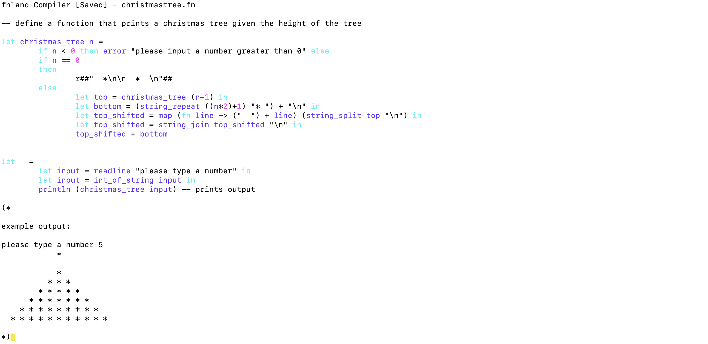
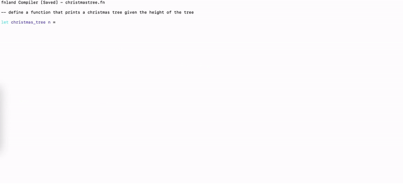
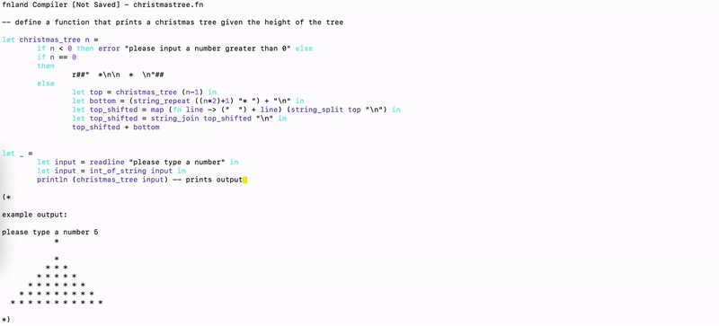

# Fnland Programming Language and Fnland IDE

## Project Team

This project was completed by 3 Master's students in ECE collaboratively.

- [Tongyu Jin](https://github.com/nuts-n-bits)
- [Anthony Cui](https://github.com/Yuanlong-Tony-Cui)
- [Yingjian Bai](https://github.com/BigBigBai)

The repository used for development has been made private with the exception of this README file. Please contact the authors if you would like to read the source code.

## Introduction

For this project, we set out to design our own programming language and write a language-specific IDE for its developers, which include a code editor and a compiler. This is an interesting project that allowed us to dive into the more arcane world of language design, and we took this opportunity to come up with a new language that we call "Fnland" with a number of properties that isn’t available in many of the more popular languages. The Fnland IDE, named "FnIde", creates a tool for Fnland developers to more easily write Fnland code. For the compiler which is available in both CLI (command-line interface) and FnIde, we chose to make JavaScript as the compiled output due to its expressive syntax, feature-rich runtime, and reflective properties, which relieves us from the time-consuming process of implementing complex runtime infrastructure like memory management, allowing us to complete the project within a limited time frame.

## Motivation

<!-- "What motivated your team to spend time on this project? An excellent project idea is satisfying and fun to work on, and fills a gap that may not be easily found in the Rust ecosystem." -->

We as computer science students have written a number of applications and system software tools (e.g. an OS kernel) through university courses and extracurricular projects. Therefore, writing another general-purpose application was not appealing to us for this Rust-based project. Among the entire technology stack that makes a computer work, how compilers do their work was still somewhat of a mystery to us, so we wanted to create one from the ground up and tackle this last remaining puzzle piece. Since the team members all have a passion for programming languages, we wanted to experiment with designing a new programming language for developers.

## Objectives

1. Design a new language (to explore intriguing ideas and design considerations from the language design community)
This language should preferably have some innovative, or at least non-common language features, both syntactically and semantically. 

    - This language may have a radically different syntax than conventional languages. **[Achieved]**

    - For example, DreamBerd, a parody programming language, has a language feature where a `?` will output the evaluation result of the preceding expression to the debug console and return the result (i.e. equivalent to `dbg!(...)` in Rust). We want to incorporate this feature into our language. **[Achieved]** 

    - *Bonus*: It would be nice to have features like variable shadowing, recursive referencing, and partial application. **[Achieved]**

    - *Note*: The goal is not to create a feature-complete language or to make the language commercially successful.

2. Make a compiler which compiles the language into an abstract syntax tree (AST). **[Achieved]**

    - *Note*: The speed and efficiency of the compiler isn’t of top concern for us, and instead, our compiler code should focus on clarity of code and logic. For simplicity, we will skip or offload optimization.

3. Create a code generator.

    - We could transpile the AST into JavaScript, thus creating a transpiler. **[Achieved]**

    - *Bonus*: If time permits, we could also generate an LLVM intermediate representation (IR), allowing direct compilation to machine code. If we decide our language should have managed memory, we will include a garbage collector too. [Skipped]

4. Build a toolkit that allow developers to easily use the new language.

    - A CLI-based tool should be built as the minimum to allow developers to compile an existing Fnland file. **[Achieved]**

    - A UI-based tool will be very helpful that allows developers to write Fnland code efficiently by looking at syntax highlights and also compile their code directly from the UI. **[Achieved]**

## Video Demo

Please use [this link](https://www.youtube.com/watch?v=0jBT-Ef09SE) to watch our demo video. Meanwhile, the reader may also reference the Features section to better understand the video demo.

## Features

<!-- "What are the main features offered by the final project deliverable? -->

### Features of Fnland

We start by introducing the basic syntax of the language.

#### Comments
```
-- a line comment stars with two dashes and extends to the end of a line
(* 
  a block comment starts with parenthesis and star and ends with star and right parenthesis. 
  a block comment can span multiple lines
  (* a block comment can have other block comments nested in it *)
*)
```

#### Global variable binding
```
let a = 5               -- this is a scalar variable number
let b = "hello world"   -- this is a scalar variable string
let add a b = a + b     -- this is a function that adds two values together
let list = [add; a; b;] -- this is a list that contains a function and two scalar variables
```
Notice how there is no separate syntax for function declaration. Functions are defined just like vairables with extra arguments.

#### `in` expressions provides scope
Syntax: `let variable_name = (expression1) in (expression2)`. 
This variable will only be available in expression2, and will not pollute the global namespace. Example: 
```
let greeting = 
        let name = "Steve" in
        "Hello, " + name
-- over here, `greeting` is defined, but `name` is unbound
```

#### Variable shadowing
`In` expressions can be chained. When two `in` expressions bind to the same identifier, the former is shadowed.
```
let i = 
        let i = 5 in
        let i = 6 in
        i 
(* comment: i will be 6 *)
```

#### Raw string
Fnland supports raw string like rust
```
let str = r#####"

        this is a raw string
   it has many lines
        you can put anything here 
   even substrings like r##"substring"##

"#####
```

#### Function application
Funciton application in most other languages: `add(1, 2)`

Funciton application in fnland: `add 1 2`
```
let add a b = a + b
let a = add 1 2 
let b = add (add 1 2) (add 3 4)
```

#### Partial application
You can supply insufficient arguments to a function, instead of raising an error, a closure is automatically created
```
let add a b = a + b
let add_two = add 2
let result = add_two 3  -- comment: returns 5
```

#### Whitespace insensitivity
Fnland programs are insensitive to whitespace (including linebreaks). The following two global declarations are equivalent:
```
let a = let sqrt x = x ** 0.5 in if b > 0 then sqrt a else sqrt -a
let b = 
        let sqrt x = x ** 0.5 in
        if b > 0 then sqrt b
        else sqrt -b
```
Notice how fnland programs do not require statement separators `;` `{` `}` unlike C, yet do not require whitespace sensitivity unlike python.
The only other languages that have this property that I know of are: 
 - lisp (and family), which uses expressions clearly delimited by parentheses,
 - lua, which is widely considered a beautifully designed language, 
 - OCaml, which fnland is heavily based upon. 

#### Immutability
Everything in fnland is strictly immutable. There are only variable binding expressions `let ... = ... in ...`, there are no re-assignment expressions.

When some logic requires mutability, use lists, recursion, map, fold, and other functional primitives to achieve the same outcome.

Code examples are available in ./code_examples, where we showcase how to write fibonacci, christmas_tree, and longest_consequtive_sequence in fnland.

#### Debug expression
By adding a `?` operator after any legal expression, the program will print its value to the console and the program will execute normally.
```
let add a b = a? + b
```
The debug operator is reminiscent to the rust dbg!() macro. The following rust code is equvalent to the above fnland code: 
```rs
fn add(a, b) { dbg!(a) + b }
```

#### `if` expression
Unlike C but like rust, the if expression is not a statement, it returns value.
```
let can_buy_liquor age = if age >= 18 then true else false
```

#### Anonymous function expression
When using functional programming primitives such as `map` `reduce` `fold`, anonymous functions are preferred. This feature may be called "lambda" in other languages.
```
let sum list = reduce (fn acc ele -> acc + ele) 0 list
let list = [1; 2; 3;]
let _ = println (sum list) -- should print 6
```

#### `io-then` expression
If an expression has side-effects, but the return value is not important, use `io-then` expression to execute the side effect and disgard the return value. 
```
let _ =
        let hello = "hello " in
        io println hello then
        let world = "world" in
        io println world then
        ()

```

#### Standard library
Fnland provides these standard library functions: `head` `tail` `snd` `cons` `map` `reduce` `fold` `println` `read_line` `int_of_string` `max` `min` `reverse` `length` `string_repeat` `zip` `string_split` `string_join`

### Complete grammar rule

The complete grammar rule of the language is defined by this generative ruleset:


### Features of FnC and FnIde

The user may directly look at the Developer's Guide section below to learn about the main features of FnC (Fnland Compiler) and FnIde (Fnland IDE).

## Developer's Guide

<!-- "How does a user — or developer, if the project is a crate — use each of the main features in the project deliverable?" -->

Welcome to the Developer's Guide for Fnland and FnIde!

### Prerequisites

Thank you for your interest in using Fnland. Please follow the steps below to get started:

1. Download or `git clone` this Git repository to your computer.
2. `cd` into the root directory of this repo, named `fnland`.
3. Run `cargo build` to obtain `target/debug/fnc` and `target/debug/fnide`.

### Using `fnc`

To use `fnc` (Fnland Compiler), you will need to run it on an existing Fnland file while following these steps:

1. Create a fnland file, for example `christmastree.fn`. Since you may be unfamiliar with the syntax to write a working program, you can grab this file from `./code_examples`.
2. Open up `christmastree.fn` to check out that it's actually fnland code.
  > Since no editor supports syntax highlighting for our code, we have created a code editor `fnide` with syntax highlighting which we will showcase in the following sections.
3. Run `target/debug/fnc christmastree.fn -o christmastree.js`, assuming you're at project root folder.
4. You can run the js file in any browser console (press F12 or cmd+option+I on macos), or run with deno runtime (see reproducibility guide).
5. The code will prompt you `please type a number`, and you can enter a positive integer here, then a Christmas tree will be printed out:
```
        *
      
        *  
      * * * 
    * * * * * 
  * * * * * * * 
```

### Using FnIde

To use FnIde (Fnland IDE), you will need to have an existing Fnland file. If you don't, you may create an empty one using `touch`.

**Important**: The IDE does not yet support scrolling. To avoid scrolling, please maximize your terminal window size, and make the font smaller than the default (by pressing `ctrl`/`cmd` + `-`).

1. FnIde allows you to view your Fnland files with Fnland-specific syntax highlighting. To open up `christmastree.fn` in FnIde, run the following command in the terminal window:
```sh
# Assuming you are at the project root folder
target/debug/fnide christmastree.fn
```

2. In your FnIde, you will see the code in `<christmastree.fn>`, and each type of tokens (e.g. keywords, operators, identifiers) is rendered in its assigned colour such that Fnland developers can more easily understand the code.

    

3. You may go on and edit your `<christmastree.fn>`. Use Up / Down / Left / Right Arrow Keys to navigate in your code and start typing to see how FnIde re-renders it accordingly. In the GIF below, the Fnland developer was able to move the cursor to the `println` call and type a comment using `"--"` that says `"prints output"`.

    

4. You may also save the file after you edit it by pressing `Fn` + `F2` and compile the Fnland code to JS by pressing `Fn` + `F5`, after which the equivalent JS code will be printed to the terminal. In the GIF below, notice how the file status in the top left corner was changed from "Not Saved" to "Saved" when the user saved the file and how the JS code was generated in the terminal view.

    

5. If the file is saved, you may also directly exit the FnIde by pressing `esc`.

## Reproducibility Guide

<!-- "What are the commands needed to set up the runtime environment, if any, and to build the project, so that its features can be used by a user or a developer? Note: The instructor will follow the steps you have included in this section, step-by-step, with no deviation. The instructor has access to a Ubuntu Linux server and a macOS Sonoma laptop computer." -->

To reproduce the effects of the video demo, do the following:
1. `cargo build` the project. 
2. Go to `./code_examples`
3. Run `../target/debug/fnc introduction.fn -o introduction.js`
3. Run `../target/debug/fnc christmastree.fn -o christmastree.js`
3. Run `../target/debug/fnc longest_consequtive_sequence.fn -o longest_consequtive_sequence.js`
3. Run `../target/debug/fnc fibonacci.fn -o fibonacci.js`
3. Run `../target/debug/fnc reduce.fn -o reduce.js`
4. Open the `.js` files to see the compiler output.

To run the JS file, you need either a browser window or the `deno` runtime. **Important: Nodejs does not provide web functions so you can not use node.**

### Without installing the `deno` runtime

If you do not want to install the `deno` runtime, you may just paste the JS code into Firefox or Chrome console to run it. 

### Installing the `deno` runtime

`deno` is a JS runtime created by Ryan Dahl, the same person who created node. `deno` provides web-standard functions which we rely on. To obtain deno runtime, go to `./deno_runtime` folder, inside are deno binaries for windows_x86_64, linux_x86_64, macos_x86_64, and macos_arm. The deno binary is a single file. You can also get directly from [source](https://github.com/denoland/deno/releases). Decompress and run the binary directly, or move to `/usr/local/bin` to get the deno command. run `deno run [compiled_file.js]` to get the same output as demo video.

## Individual Contributions

<!-- "What were the individual contributions by each member in the team?" -->

In the project, each team member had his own dedicated technial task to work on while sharing some responsibilities like writing the documentations.

   - Tongyu Jin: language design, tokenizer, parser (partially), generator (partially), demo.

   - Yingjian Bai: All test cases, parser (partially), generator (partially).  

   - Anthony Cui: focused on building `fnc` and FnIde (the IDE for Fnland developers), including code navigation, code editing, Fnland-specific syntax highlighting, and compliation from FnIde. Anthony also worked on the CLI tool which compiles Fnland files from the terminal.

All three members contributed to the proposal documentation and the project report. 

## Lessons and Remarks

<!-- "Write about any lessons the team has learned throughout the project and concluding remarks, if any." -->

To conclude with, we believe it was a very rewarding experience for us to design this new programming language and build a developer toolkit for it. We originally planned on making this language have a few uncommonly advanced features, which we *have* successfully implemented through the course of over one month.

1. The first lesson we learned is that how Rust's algebraic type system was a massive life-saver. We encountered numerous errors when writing and compiling our Rust code, many of which are `match` statements not fully covering all possible enum cases. (Our AST is a huge `enum` with many many variants). In a language like C, JS or Go, we would have wasted a massive amount of time chasing this type of errors alone. That was the time when we all truly understood that Rust forces us to double-check our logic by giving compiling time errors and minimizes the risks of building buggy software. After using rust, we desire sum types for golang, and we cannot imagine how we lived without it.

2. The second lesson we learned is that a daunting task might not always be as challenging as it seems - if we split up the work and scheduled our deadlines properly. This project was indeed a difficult one, but every building block in it was feasible and testable, which is how we tackled this problem incrementally.

3. The third lesson we learned is that engineers should always be open to new knowledge and new technologies. Now that the project is officially completed, we feel that building this compiler has allowed us to understand the arcane world of lexical analysis, parsing, and code generation, enhancing our understanding of how different components interact. Next time when we open up VSCode or PyCharm to write and compile our code, we will be able to "see through" those black boxes of IDEs.

*Bonus*: We see this project of ours very unique (has never been done previously) because it involves the design of a very special programming languages with a unique set of features. The language is so novel that we had to build a dedicated toolkit for developers to use it.

*Bonus*: We also believe this project has its own educational benefits to students studying computer science. Looking at the source code, students will understand how a compiler works from its inside. The IDE also serves as a great coding playground for students to play around with Fnland to more deeply understand in what cases different features of programming language (e.g. partial application) can be useful.
